# Data Visualization.

ข้อมูลที่จะนำมาแสดงนั้นเป็นข้อมูลที่ได้จากเครื่อง Gateway โดยข้อมูลที่ดึงมาแสดงจะ
ประกอบด้วย 1. อุณหภูมิ 2. ความชื้น 3. แสง 4. แรงดันไฟฟ้า  5. สถานะ Gateway

- # IOT sensuor Humidity


- # IOT sensor AVG Temperature
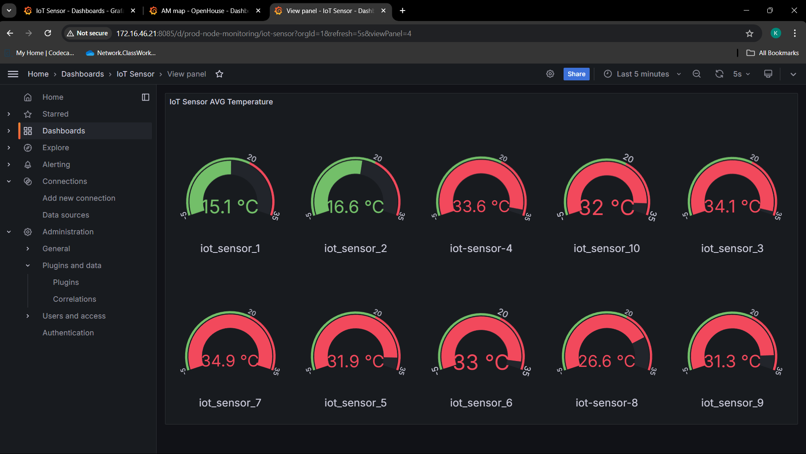

- # IOT sensuor Luminosity
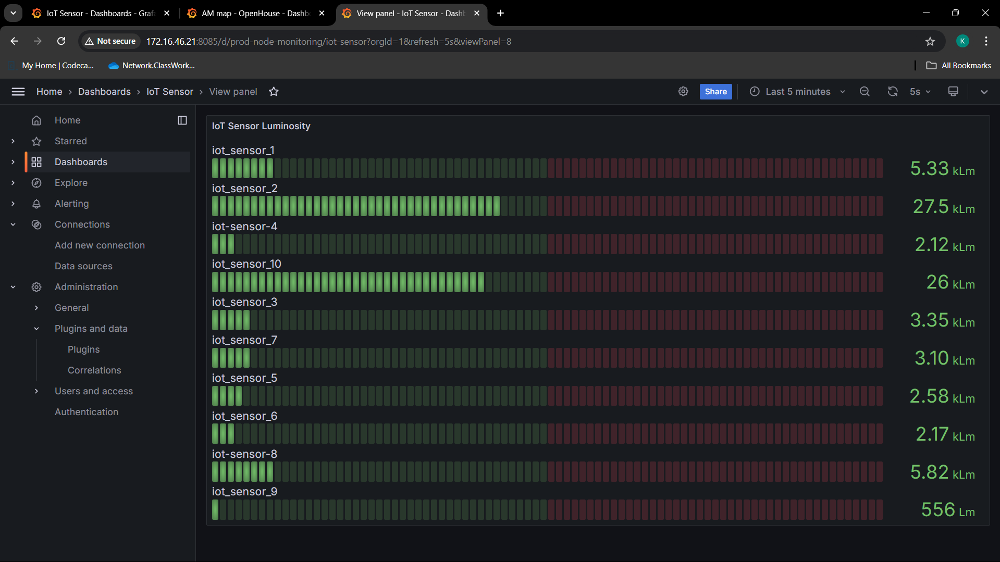

- # IOT sensuor Pressure
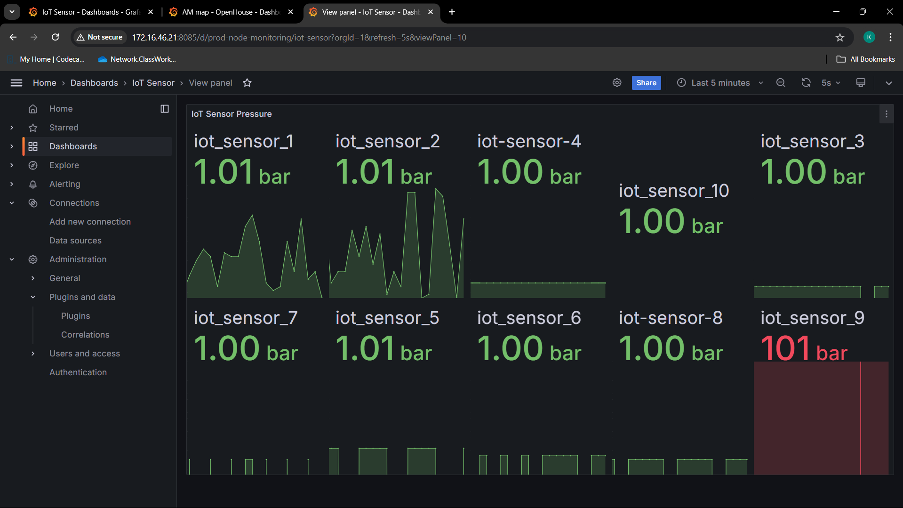

- # IOT sensor Temperature
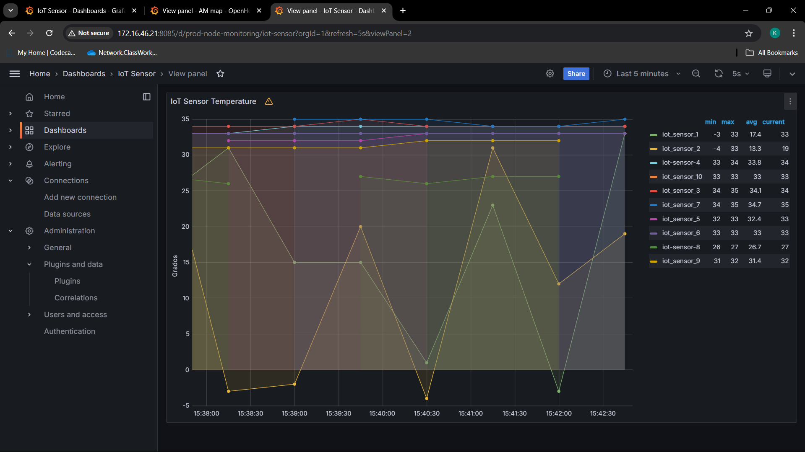

- # IOT 10 sensor map dashbord
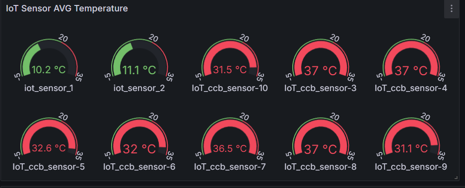

- # Node Exporter
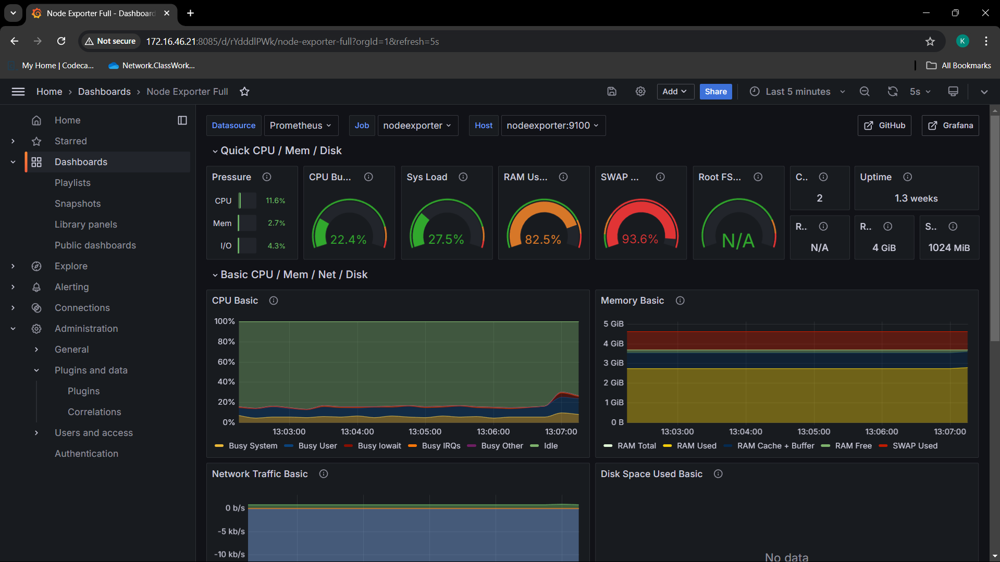

- # วิธีการทำ IOT 10 sensor map dashbord

1. ลง Plugin Flowcharting จาก (https://github.com/skyfrank/grafana-flowcharting/releases/tag/v1.0.0e)

- Remote เข้าไปในเซิร์ฟเวอร์ เข้าไปใน folder Plugin ของ grafana

- สร้าง Directory ใหม่เพือลงไฟล์ Zip ในเซิร์ฟเวอร์ 

```cpp
sudo mkdir Name_directory
```

- เข้าไปใน Directory ใหม่ที่สร้างไว้

- โหลดไฟล์ zip เข้าเซิร์ฟเวอร์

```cpp
sudo wget Link_by_Flowcharting
```
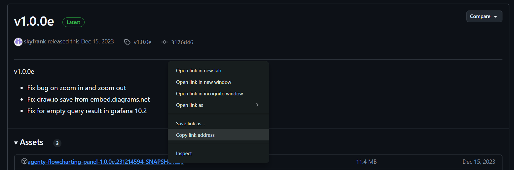

- แตกไฟล์ Zip

```cpp
sudo unzip File_name
```

- ย้ายไฟล์ dist ออกมาจาก Directory

```cpp
sudo mv dist Grafana-flowcharting
```

- ebit flie docker-compose.yml ที่บรรทัด 289,290

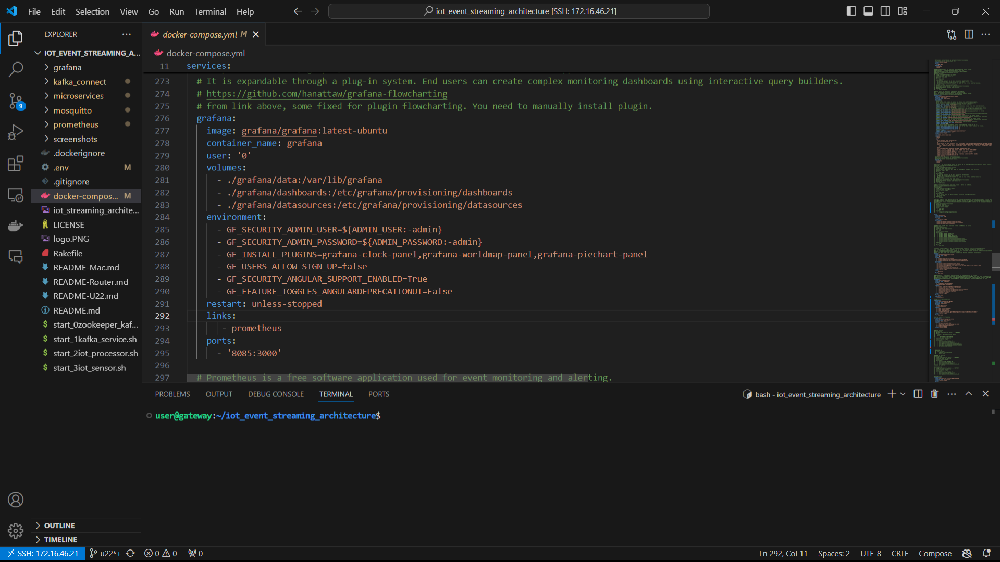

- restart grafana

```cpp
docker compose restart grafana
```

2. เลือกใช้ plugin ใน dashboard

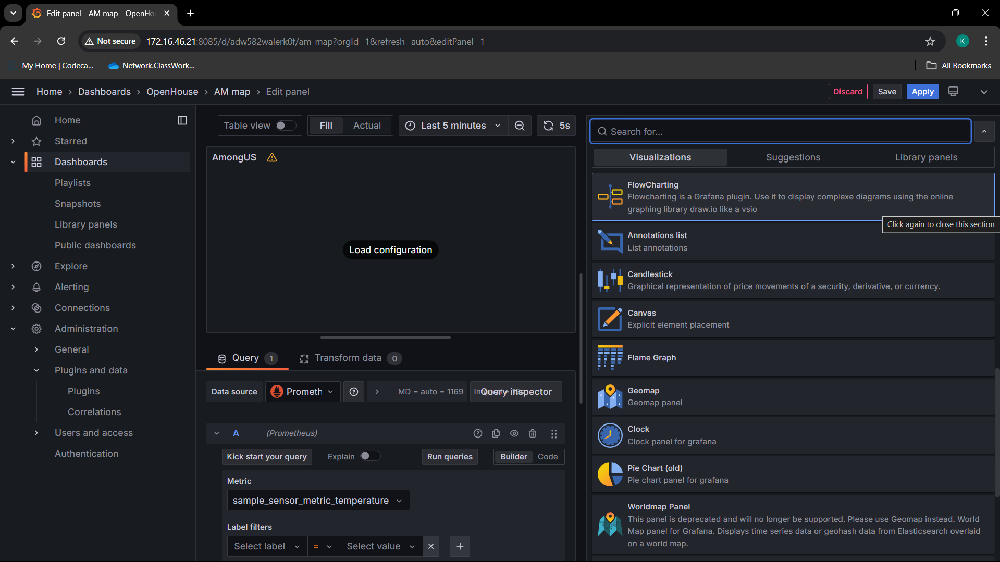

3. เลือกดึงข้อมูลจาก Prometheus โดยเซ็ตข้อมูลที่ต้องการใน Metric


- เซ็ต Options เพื่อความสดวกในการเรียกใช้

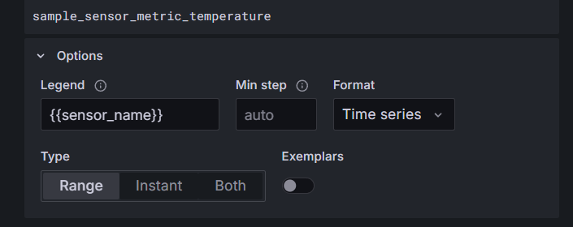

4. เซ็ตภาพที่ต้องการ ใน Draw.io โดยใช้คำาสั่ง Edit Diagram

- import ไฟล์ .csv (สามารถนำไฟล์ ภาพ เข้าในโปรแกรม Draw.io แล้ว export ออกมาเป็นไฟล์ .csv ได้)

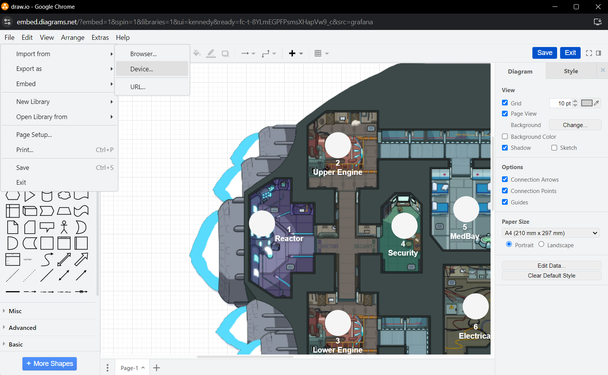

- วาง Opject ลงในจุดที่ต้องการแล้ว กด save

5. เลื่อนไปที่ Rule เพื่อ เซ็ต จุดวางเซ็นเซอร์แต่ละตัว

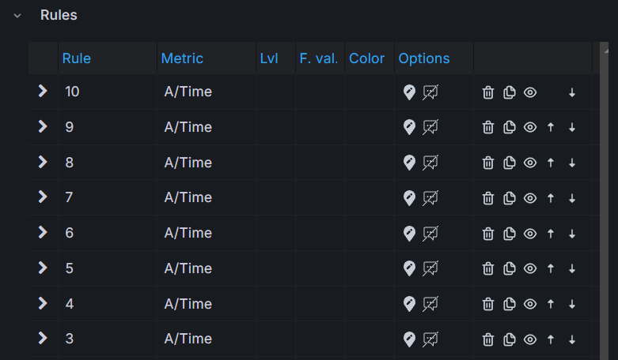

- เซ็ตข้อมูลที่ต้องการดึง

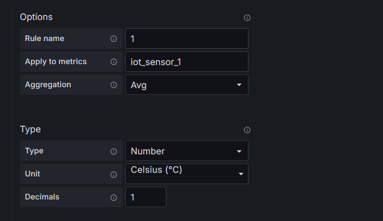

- เซ็ตสีที่ต้องการ

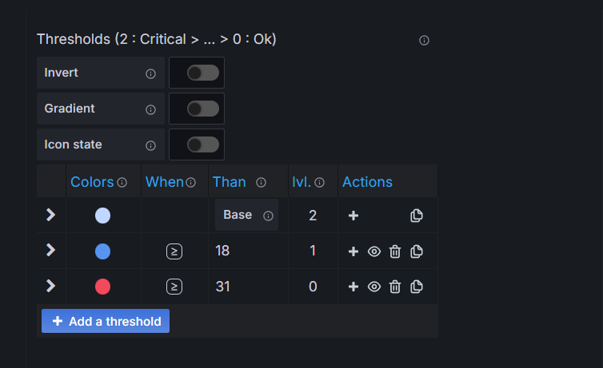

- เลือก Opject และ Text ที่ต้องการแสดง

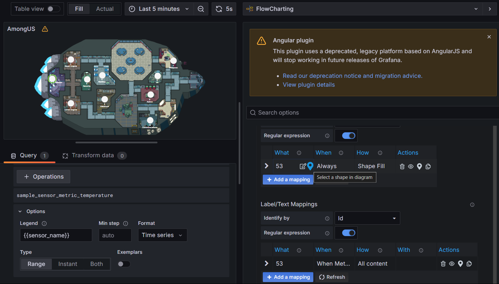

- save, apply

- # วิธีการทำ Node Exporter

- Edit File docker-compose.yml node exporter

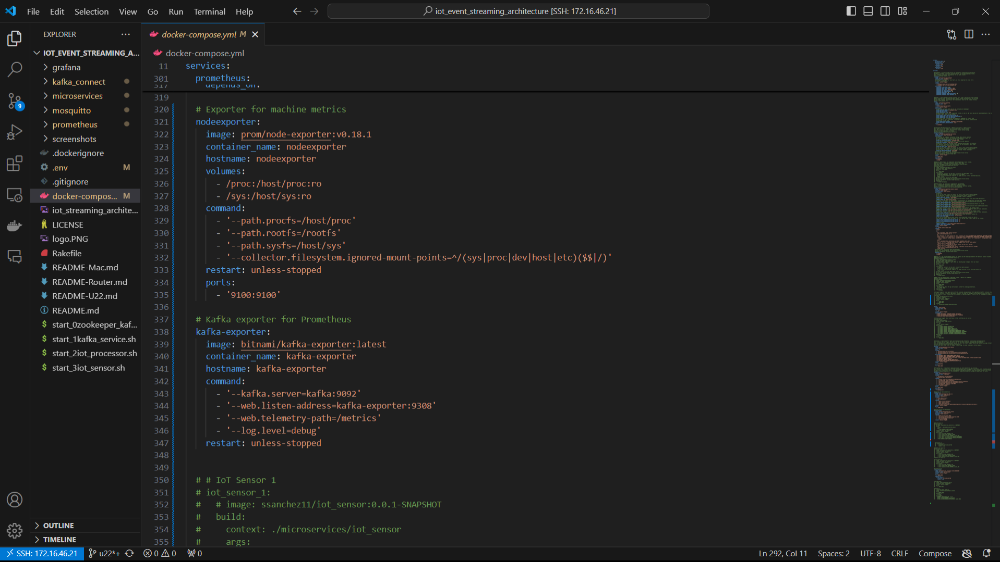

- Edit File prometheus.yml

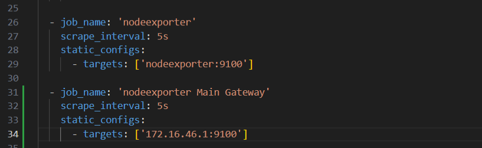

- restart prometheus

```cpp
docker compose restart prometheus
```

- ลง Dashbord ใน Grafana โดย import dashbord json file (เลือก template จากใน Internet)
