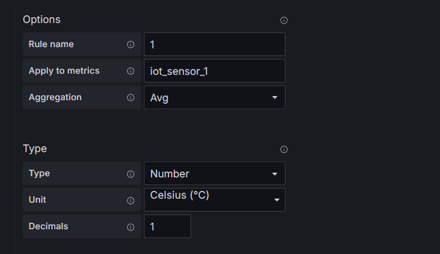
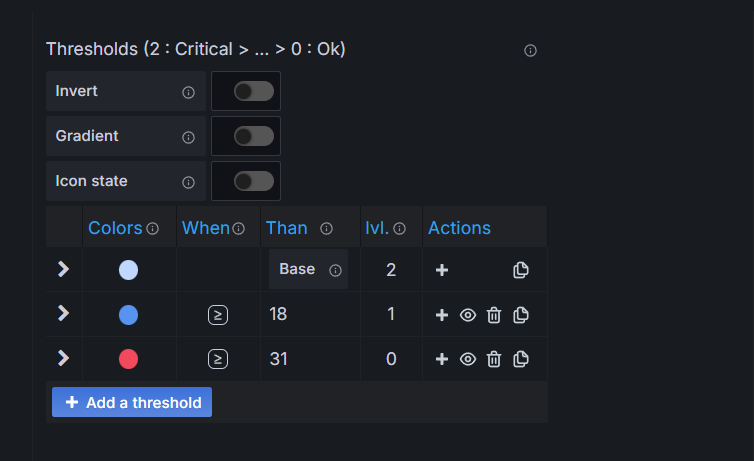
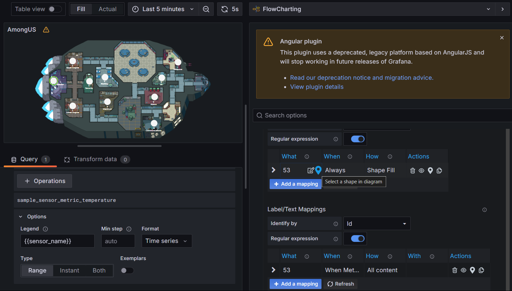

# Data Visualization.

ข้อมูลที่จะนำมาแสดงนั้นเป็นข้อมูลที่ได้จากเครื่อง Gateway โดยข้อมูลที่ดึงมาแสดงจะ
ประกอบด้วย 1. อุณหภูมิ 2. ความชื้น 3. แสง 4. แรงดันไฟฟ้า  5. สถานะ Gateway

- # IOT sensuor Humidity

- # IOT sensor AVG Temperature

- # IOT sensuor Luminosity

- # IOT sensuor Pressure

- # IOT sensor Temperature

- # IOT 10 sensor map dashbord

- # Node Exporter

- # วิธีการทำ IOT 10 sensor map dashbord

1. ลง Plug in Flowcharting จาก (https://algenty.github.io/flowcharting-repository/INSTALL.html)

2. เลือกใช้ plug in ใน dashboard

3. เลือกดึงข้อมูลจาก Prometheus โดยเซ็ตข้อมูลที่ต้องการใน Metric

- เซ็ต Options เพื่อความสดวกในการเรียกใช้

4. เลื่อนไปที่ Rule เพื่อ เซ็ต จุดวางเซ็นเซอร์แต่ละตัว

- เซ็ตข้อมูลที่ต้องการดึง

- เซ็ตสี่ที่ต้องการ

- เลือก Opject และ Text ที่ต้องการแสดง

- save, apply